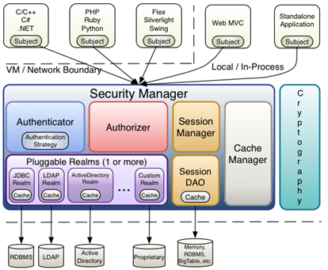

# shiro简介
Apache Shiro 是 Java 的一个安全框架。

Shiro 可以帮助我们完成：认证、授权、加密、会话管理、与 Web 集成、缓存等。


- Authentication：身份认证 / 登录，验证用户是不是拥有相应的身份；

- Authorization：授权，即权限验证，验证某个已认证的用户是否拥有某个权限；即判断用户是否能做事情，常见的如：验证某个用户是否拥有某个角色。或者细粒度的验证某个用户对某个资源是否具有某个权限；

- Session Manager：会话管理，即用户登录后就是一次会话，在没有退出之前，它的所有信息都在会话中；会话可以是普通 JavaSE 环境的，也可以是如 Web 环境的；

- Cryptography：加密，保护数据的安全性，如密码加密存储到数据库，而不是明文存储；

- Web Support：Web 支持，可以非常容易的集成到 Web 环境；

- Caching：缓存，比如用户登录后，其用户信息、拥有的角色 / 权限不必每次去查，这样可以提高效率；

- Concurrency：shiro 支持多线程应用的并发验证，即如在一个线程中开启另一个线程，能把权限自动传播过去；

- Testing：提供测试支持；

- Run As：允许一个用户假装为另一个用户（如果他们允许）的身份进行访问；

- Remember Me：记住我，这个是非常常见的功能，即一次登录后，下次再来的话不用登录了。

记住一点，Shiro 不会去维护用户、维护权限；这些需要我们自己去设计 / 提供；然后通过相应的接口注入给 Shiro 即可。


## 一、首先，我们从外部来看 Shiro 吧，即从应用程序角度的来观察如何使用 Shiro 完成工作。如下图：


可以看到：应用代码直接交互的对象是 Subject，也就是说 Shiro 的对外 API 核心就是 Subject；其每个 API 的含义：

Subject：主体，代表了当前 “用户”，这个用户不一定是一个具体的人，与当前应用交互的任何东西都是 Subject，如网络爬虫，机器人等；即一个抽象概念；所有 Subject 都绑定到 SecurityManager，与 Subject 的所有交互都会委托给 SecurityManager；可以把 Subject 认为是一个门面；SecurityManager 才是实际的执行者；

SecurityManager：安全管理器；即所有与安全有关的操作都会与 SecurityManager 交互；且它管理着所有 Subject；可以看出它是 Shiro 的核心，它负责与后边介绍的其他组件进行交互，如果学习过 SpringMVC，你可以把它看成 DispatcherServlet 前端控制器；

Realm：域，Shiro 从从 Realm 获取安全数据（如用户、角色、权限），就是说 SecurityManager 要验证用户身份，那么它需要从 Realm 获取相应的用户进行比较以确定用户身份是否合法；也需要从 Realm 得到用户相应的角色 / 权限进行验证用户是否能进行操作；可以把 Realm 看成 DataSource，即安全数据源。

也就是说对于我们而言，最简单的一个 Shiro 应用：
1、应用代码通过 Subject 来进行认证和授权，而 Subject 又委托给 SecurityManager；
2、我们需要给 Shiro 的 SecurityManager 注入 Realm，从而让 SecurityManager 能得到合法的用户及其权限进行判断。

**从以上也可以看出，Shiro 不提供维护用户 / 权限，而是通过 Realm 让开发人员自己注入。**

## 二、接下来我们来从 Shiro 内部来看下 Shiro 的架构，如下图所示：
     


- Subject：主体，可以看到主体可以是任何可以与应用交互的 “用户”；

- SecurityManager：相当于 SpringMVC 中的 DispatcherServlet 或者 Struts2 中的 FilterDispatcher；是 Shiro
 的心脏；所有具体的交互都通过 SecurityManager 进行控制；它管理着所有 Subject、且负责进行认证和授权、及会话、缓存的管理。

- Authenticator：认证器，负责主体认证的，这是一个扩展点，如果用户觉得 Shiro 默认的不好，可以自定义实现；其需要认证策略（Authentication Strategy），即什么情况下算用户认证通过了；

- Authrizer：授权器，或者访问控制器，用来决定主体是否有权限进行相应的操作；即控制着用户能访问应用中的哪些功能；

- Realm：可以有 1 个或多个 Realm，可以认为是安全实体数据源，即用于获取安全实体的；可以是 JDBC 实现，也可以是 LDAP 实现，或者内存实现等等；由用户提供；注意：Shiro
 不知道你的用户 / 权限存储在哪及以何种格式存储；所以我们一般在应用中都需要实现自己的 Realm；

- SessionManager：如果写过 Servlet 就应该知道 Session 的概念，Session 呢需要有人去管理它的生命周期，这个组件就是 SessionManager；而 Shiro 并不仅仅可以用在 Web
 环境，也可以用在如普通的 JavaSE 环境、EJB 等环境；所有呢，Shiro 就抽象了一个自己的 Session 来管理主体与应用之间交互的数据；这样的话，比如我们在 Web 环境用，刚开始是一台 Web 服务器；接着又上了台 EJB 服务器；这时想把两台服务器的会话数据放到一个地方，这个时候就可以实现自己的分布式会话（如把数据放到 Memcached 服务器）；

- SessionDAO：DAO 大家都用过，数据访问对象，用于会话的 CRUD，比如我们想把 Session 保存到数据库，那么可以实现自己的 SessionDAO，通过如 JDBC 写到数据库；比如想把 Session
 放到 Memcached 中，可以实现自己的 Memcached SessionDAO；另外 SessionDAO 中可以使用 Cache 进行缓存，以提高性能；

- CacheManager：缓存控制器，来管理如用户、角色、权限等的缓存的；因为这些数据基本上很少去改变，放到缓存中后可以提高访问的性能

- Cryptography：密码模块，Shiro 提高了一些常见的加密组件用于如密码加密 / 解密的。

到此 Shiro 架构及其组件就认识完了，接下来挨着学习 Shiro 的组件吧。
 
# shiro身份验证
身份验证，即在应用中谁能证明他就是他本人。一般提供如他们的身份 ID 一些标识信息来表明他就是他本人，如提供身份证，用户名 / 密码来证明。
 
在 shiro 中，用户需要提供 principals （身份）和 credentials（证明）给 shiro，从而应用能验证用户身份：
 
- principals：身份，即主体的标识属性，可以是任何东西，如用户名、邮箱等，唯一即可。一个主体可以有多个 principals，但只有一个 Primary principals，一般是用户名 / 密码 / 手机号。
- credentials：证明 / 凭证，即只有主体知道的安全值，如密码 / 数字证书等。
   
最常见的 principals 和 credentials 组合就是用户名 / 密码了。接下来先进行一个基本的身份认证。
   
另外两个相关的概念是之前提到的 Subject 及 Realm，分别是主体及验证主体的数据源。

# shiro授权
授权，即访问控制，控制谁能访问哪些资源。主体进行身份认证后需要分配权限方可访问系统的资源，对于某些资源没有权限是无法访问的。

授权可简单理解为who对what(which)进行How操作：
- Who，即主体（Subject），主体需要访问系统中的资源。
- What，即资源（Resource)，如系统菜单、页面、按钮、类方法、系统商品信息等。资源包括资源类型和资源实例，比如商品信息为资源类型，类型为t01的商品为资源实例，编号为001的商品信息也属于资源实例。
- How，权限/许可（Permission)，规定了主体对资源的操作许可，权限离开资源没有意义，如用户查询权限、用户添加权限、某个类方法的调用权限、编号为001用户的修改权限等，通过权限可知主体对哪些资源都有哪些操作许可。

授权方式

1、基于角色的访问控制

RBAC基于角色的访问控制（Role-Based Access Control）是以角色为中心进行访问控制
```伪代码
if(subject.hasRole("admin")){
   //操作什么资源
}
```
2、基于资源的访问控制

RBAC基于资源的访问控制（Resource-Based Access Control）是以资源为中心进行访问控制
```伪代码
if(subject.isPermission("user:update:01")){ //资源实例
  //对01用户进行修改
}
if(subject.isPermission("user:update:*")){  //资源类型
  //对01用户进行修改
}
```

权限字符

​权限字符串的规则是：
```
资源标识符：操作：资源实例标识符
```
意思是对哪个资源的哪个实例具有什么操作，“:”是资源/操作/实例的分割符，权限字符串也可以使用*通配符。

例子：

- 用户创建权限：user:create，或user:create:*
- 用户修改实例001的权限：user:update:001
- 用户实例001的所有权限：user:*：001

shiro中授权编程实现方式

1、编程
```伪代码
Subject subject = SecurityUtils.getSubject();
if(subject.hasRole(“admin”)) {
	//有权限
} else {
	//无权限
}
```
2、注解
```伪代码
@RequiresRoles("admin")
public void hello() {
	//有权限
}
```
3、标签
```伪代码
JSP/GSP 标签：在JSP/GSP 页面通过相应的标签完成：
<shiro:hasRole name="admin">
	<!— 有权限—>
</shiro:hasRole>
注意: Thymeleaf 中使用shiro需要额外集成!
```
